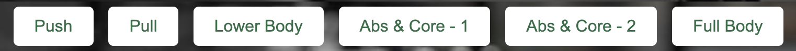
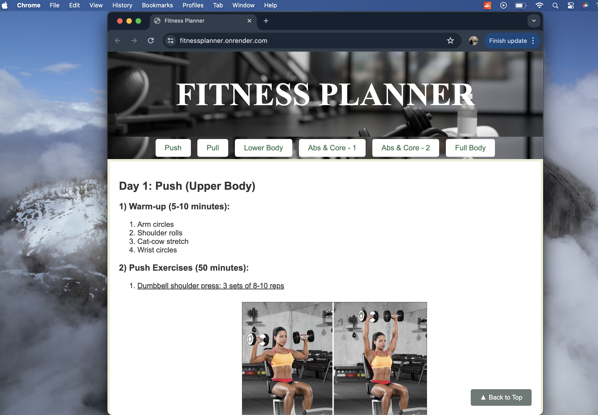

# Fitness Planner Web Application

## Description

The Fitness Planner Web Application is a responsive web application designed to provide users with a structured workout plan for various muscle groups. Users can navigate through different sections such as Push, Pull, Lower Body, Abs & Cardio - 1, Abs & Cardio - 2 and Full Body to access workout routines and instructional videos for each exercise.

## Features

- Structured workout plan for different muscle groups
- Exercise descriptions and instructional videos
- Smooth navigation using buttons
- Responsive design for seamless user experience on various devices

## Screenshots

### Main Page

### Mobile Device View

### Interactive Navigation Buttons

### Navigation Button

### Interactive Nav Button

### Navigation Buttons

### Responsive Design

## Description

This project is designed to help users plan their workouts effectively. It includes various exercises categorized by muscle groups, along with instructional videos for each exercise for reference.

## Technologies Used

- HTML
- CSS
- JavaScript
- Node.js
- Express.js

## Hosting the Server

To host the server on other devices connected to the same network:

1. Ensure Node.js and npm are installed on your machine.
2. Clone the repository:
`git clone https://github.com/Shravani73/FitnessPlanner.git`
3. Navigate to the project directory and install dependencies:
cd workout-plan
npm install
4. Start the server:
node webpage.js
5. Access the application from other devices using the server's IP address and port number. By default, the server runs on port 3000. If you've configured a different port, replace `3000` with your custom port number.

## How to Use

1. Clone the repository:
`git clone https://github.com/Shravani73/FitnessPlanner.git`
2. Open the `index.html` file in your web browser to view the workout plan.
3. Click on the navigation buttons to navigate to different sections of the workout plan.
4. Enjoy your workout!

## Usage

- Click on the navigation buttons to navigate to different sections
- Click on the exercise images to watch instructional videos
- Enjoy your workout!

## Credits

### Images
- Images used in this project were sourced from Google Images.

### Exercise Videos
- Exercise videos linked in this project were sourced from YouTube and other fitness-related websites.

We acknowledge and appreciate the creators and sources of the images and videos used in this project. If you have any concerns regarding the usage of specific content, please contact us.

## License

This project is licensed under the [MIT License](LICENSE.txt) - see the LICENSE.txt file for details.

